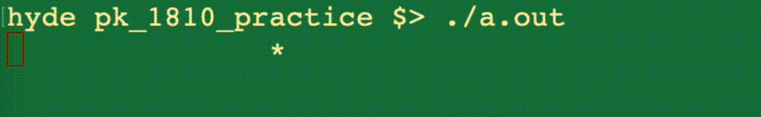
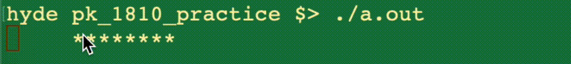
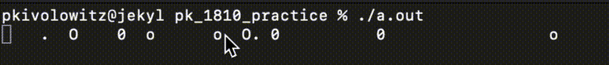
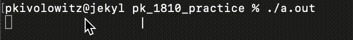

# CSC1810 Practice Programs

## Specifications are skimpy

The projects described and contained here are meant for fun practice. You won't find these specified to the usual degree.

## single_star

In this program, you'll animate a single asterisk causing it to bounce back and forth from column zero to some column (currently defined as 40).

You'll learn:

* how to force output to happen even before a new line character
* how to overwrite a line on the console (rather than advancing to a new line)
* how to delay your program's execution for a short while (for timing purposes)
* usage of `cinttypes` which makes the specific flavor of an integer unambiguous

Write a program that animates a single asterisk like this:



Don't worry about the program terminating - just kill it when you're done looking.

No data structure is needed for this program as everything you need to do is based on a counter.

You'll need these include files:

```c++
#include <iostream>
#include <iomanip>
#include <cinttypes>
#include <chrono>
#include <thread>
```

I used the features of `iomanip` to space out the animating asterisk.

`cinttypes` contains aliases for integer types that are unambiguous. That is, when you say `int`, how big is it? Depends. Using `cinttypes` you can declare:

| type | meaning | without cinttypes |
| ---- | ------- | ----------------- |
| uint8_t | unsigned 8 bit integer | unsigned char |
| uint16_t | unsigned 16 bit integer | unsigned short |
| uint32_t | unsigned 32 bit integer | unsigned int |
| uint64_t | unsigned 64 bit integer | unsigned long |
| int8_t | signed 8 bit integer | char |
| int16_t | signed 16 bit integer | short |
| int32_t | signed 32 bit integer | int |
| int64_t | signed 64 bit integer | long |

`chrono` and `thread` are used together to implement delays in your program. Without pausing your program, it will update the screen so quickly, you won't be able to enjoy the animation.

For example:

```c++
this_thread::sleep_for(chrono::milliseconds(16));
```

will cause your program to sleep for at least 16 milliseconds but maybe a tad more. The value 16 milliseconds is chosen as it is 1/60th of a second.

### Output without new lines

You're used to this:

```c++
cout << "Foo" << endl;
```

The `endl` is doing two things for you:

1. Of course, it's giving you a new line but it is also
2. Triggering the output to actually render on your console

Console output is buffered for efficiency. Actual output only happens when new lines are emitted. In this program, we're not using new lines at all. Instead, after text is output, we'll emit only a carriage return ('\r').

To force output (without a new line), do:

```c++
cout.flush();
```

### Source code

DO NOT LOOK AT [THIS](./single_star.cpp) UNTIL YOU HAVE TRIED TO WRITE THE CODE YOURSELF! With that said, don't feel bad about taking a peek and reading the comments.

### Related projects

* Multiple stars
* Walkies

## Multiple stars

This program is a little harder. Instead of a single asterisk animating, see if you can make a number of asterisks (in a row) animate - like a Cylon!



as in:


Use 8 stars.

### Source code

DO NOT LOOK AT [THIS](./multiple_stars.cpp) UNTIL YOU HAVE TRIED TO WRITE THE CODE YOURSELF! With that said, don't feel bad about taking a peek and reading the comments.

## Fizzle

Taking a different approach, `fizzle` produces this:



`fizzle` starts with all blanks in a long string. Whenever a position is blank, there is a 1 in 20 chance it will start animating.

The animation cycle is:

* `' '`
* `'.'`
* `'o'`
* `'0'`
* `'O'`
* `' '` (i.e. repeat)

One way of handling the advancement in the cycle of characters is with a `switch` statement. The transition from `' '` to `'.'` (based on a one-in-twenty) chance can be handled nicely right in the `' '` case.

These are the include files I used:

```c++
#include <cinttypes>
#include <chrono>
#include <thread>
#include <string>
#include <vector>
#include <ctime>
```

`<ctime>` is used to get access to the `time()` function which can be used to seed the old-style random number generator.

### Source code

DO NOT LOOK AT [THIS](./fizzle.cpp) UNTIL YOU HAVE TRIED TO WRITE THE CODE YOURSELF! With that said, don't feel bad about taking a peek and reading the comments.

## Walkies

`Walkies` is based on `single_star`. You'll create this:



The inter-character delay in this one must be slower - I used 100 milliseconds.

### Source code

DO NOT LOOK AT [THIS](./walkies.cpp) UNTIL YOU HAVE TRIED TO WRITE THE CODE YOURSELF! With that said, don't feel bad about taking a peek and reading the comments.

## A stupidly complex way to tell if a number is a multiple of three

This program will determine if an input number is a multiple of three. Of course, this can be done simply by checking the value of the number modded with the literal 3. But what fun would that be?

The needlessly complex algorithm is this:

    While the number of digits in a string is larger than one:
	    Sum up the value of the digits
		Replace the old value of the string with the 
		string version of the sum.
	If the single digit remaining is 0, 3, 6 or 9 the original was a multiple of three.

For example, test "6792":

* sum of digits in "6792" is 24
* sum of digits in "24" is 6
* "6" is one of the special values

The solution code contains the use of:

* user defined functions
* a range-based for loop (c++11 and later required)
* a char as a small integer
* checking for end-of-file with `getline()` and how to enter an EOF on Mac and Windows

Here is sample output:

```text
pkivolowitz@jekyl pk_1810_practice % ./a.out
Enter a number to check (or "quit"): badinput
Enter a number to check (or "quit"): 6792
Using a needlessly complex method, 6792 has been shown to be a multiple of three
Enter a number to check (or "quit"): 0
Using a needlessly complex method, 0 has been shown to be a multiple of three
Enter a number to check (or "quit"): 6793
Using a needlessly complex method, 6793 has been shown not to be a multiple of three
Enter a number to check (or "quit"): 12345678901234567890
Using a needlessly complex method, 12345678901234567890 has been shown to be a multiple of three
Enter a number to check (or "quit"): 12345678901234567891
Using a needlessly complex method, 12345678901234567891 has been shown not to be a multiple of three
Enter a number to check (or "quit"): quit
```

### Source code

DO NOT LOOK AT [THIS](./dumb_mod_three.cpp) UNTIL YOU HAVE TRIED TO WRITE THE CODE YOURSELF! With that said, don't feel bad about taking a peek and reading the comments.

## Learning to use command line arguments

If you are learning C++ using an IDE like `xcode` or `Visual Studio` you may not have used the command line directly as of yet. Being able to use the command line is a valuable job skill and greatly expands the flexibility of programs that you may write. Well, maybe I'm being generous with the `Windows` command line...

Writing programs that can make use of arguments from the command line lies in the ability to customize the operation of the program varying from invocation to invocation.

### `main()`

You may have seen this:

```c++
int main() {
}
```

This is not the whole story however. The complete signature of the `main()` function is this:

```c++
int main(int argc, char * argv[]) {
}
```

The parameters that are passed to `main()` are the arguments specified on the command line when the program is run (prepended with the name of the program being run).

The syntax of `char * argv[]` means that `argv` is an array of *pointers* to characters. *Pointer* is a fancy way of saying *address*. Everything in a running program's memory space has an address. It isn't important to master *pointers* right now. It is worth mentioning that *pointers* seem to scare a lot of people, but when you realize that everything is an *address* they really aren't that scary.

### Source code

Rather than ask you to write a program to enumerate a program's command line arguments, I'll just show you - a couple of ways - with explanation.

[Method 1](./args1.cpp)

[Method 2](./args2.cpp)

Here is a sample of outputs of either program:

```text
hyde pk_1810_practice $> ./a.out
Argument [  0] is ./a.out
hyde pk_1810_practice $> ./a.out pokwrf pokwrfwwrfwrf "powpok pok pok pok"
Argument [  0] is ./a.out
Argument [  1] is pokwrf
Argument [  2] is pokwrfwwrfwrf
Argument [  3] is powpok pok pok pok
hyde pk_1810_practice $>
```

`args1.cpp` shows the basic usage of command line arguments.

`args2.cpp` shows enumerating command line arguments in a more advanced way and serves only as a teaser for your future understanding of scary pointers. Hint: pointers are not scary.

### How do you get to command line arguments if you are not using the command line?

The project properties in `xcode` and `Visual Studio` allow for adding command line aguments. It isn't as convenient as using a command line, but it can be done and makes testing programs easier. In `xcode`, edit the `Run / Debug` scheme. In `Visual Studio`, edit the project's properties under `Debugging`.

### Common mistake

Things can end in tears (EOT) if you attempt to use an argument that isn't there. So, don't do that. Check `argc` to determine if any particular index into `argv` is valid or not.

## Practice using `argc` and `argv`

Write a program that will read the contents of a file that you specify on the command line.

Here's an outline:

* Vet the existence of `argv[1]`
* If valid, attempt to use it as a file name in an `ifstream` open.
* If the file is incorrectly opened, don't do the rest.
* Loop while getting lines from the file, printing each one.
* Close the file.

[Here](./readfile.cpp) is the source code to my solution if you want to compare. In addition to showing a use of `argc` and `argv`, the program models three good practices.

1. Only one `return` statement in a function.
2. Use of `perror()`.
3. Use of `cerr`.
4. Setting alternate values to return from the program.

## Follow up - print the file backwards

While we're here, how about getting some practice with `vector`? Modify the program you just wrote to add the lines you read into a `vector` of `string`. Then, enumerate the `vector` backwards, printing out each `string`. More than that, print each *line* backwards.

To reverse a string, you'll need `<algorith>` and a function called, wait for it, `reverse()`. `reverse()` takes `enumerators` as arguments. Every `string` has some built-in enumerators, `.begin()` and `.end()`. These are precisely the enumerators you need.

There's a bit of a trick here to avoid warnings *and* not cause errors in the loop enumerating the vector backwards. `vector` `.size()` returns a `size_t` which is an `uint64_t` - unsigned. So, if you made a `for` loop that stopped at `counter >= 0` you're in for trouble because an unsigned integer is **always** greater than or equal to zero.

There are several ways to avoid this. The [solution code](./printbackwards.cpp) shows just one of these ways.


## SAFE input from `cin`

Try this program:

```c++
#include <iostream>

using namespace std;

int main() {
	int i = 0;
	while (i != 10) {
		cout << "Enter a number: ";
		cin >> i;
	}
	return 0;
}
```

What could possibly go wrong? This program will plainly loop until you enter 10.

```text
hyde pk_1810_practice $> ./a.out
Enter a number: 5
Enter a number: 6
Enter a number: 9
Enter a number: 10
hyde pk_1810_practice $>
```

Run the program again, and enter `a` instead of a number. Prepare to terminate the program with extraordinary means.

How about this, create a text file (`numbers.txt`) with perfectly good input. Such as:

```text
1
2
3
4
```

Then run the program using redirected input.

```text
hyde pk_1810_practice $> ./a.out < numbers.txt
```

Again, you have to kill the program.

The problem is that when a `cin` fails to convert input to the type you've asked it to, certain error bits inside `cin` get set and they don't get unset. While the error bits are turned on, future attempts to use `cin` fail immediately.

This mini-project is likely too advanced for you to attempt yourself. Instead read the source code located [here](./safe_stream_input.cpp).

Feel free to use this code in your projects when using stream input and *you're interested in ensuring that conversion failures don't hurt you*.

## Problem 1 from [codewars.com](https://www.codewars.com)

Inspired by a `kata` on codewars.com...

Write a program that prompts for a string. If the string is "quit", exit the program. Otherwise split the string into a vector of strings each containing two letters. If there are an odd number of characters in the string, return the last character joined with '_'.

### Sample output 

```text
pkivolowitz@jekyl pk_1810_practice % ./a.out
Enter a string (or "quit"): mhutaq
mh
ut
aq
Enter a string (or "quit"): mi7bq
mi
7b
q_
Enter a string (or "quit"): quit
pkivolowitz@jekyl pk_1810_practice %
```

### Source code

The source code is [here](./pairs.cpp), but you should try to write this yourself.

## Problem 2 from [codewars.com](https://www.codewars.com)

Inspired by a kata on codewars.com...

Write a program that determines whether or not a number is a [Narcissistic Number](https://en.wikipedia.org/wiki/Narcissistic_number). 

From codewars.com, "A Narcissistic Number is a positive number which is the sum of its own digits, each raised to the power of the number of digits in a given base. In this Kata, we will restrict ourselves to decimal (base 10)."

codewars.com provides an example:

153 is a narcissistic number because it has 3 digits and each individual digit raised to the 3rd power, added together, equals the original number. As shown next:

```text
1^3 + 5^3 + 3^3 = 1 + 125 + 27 = 153
```

The codewars.com project creates just one function, and promises that only valid input will be passed to it. Here, you'll write a full program and must screen out and otherwise handle bad input. This might be a good place to practice with `SafeStreamINput()`.

### Source code

The source code is [here](./narc.cpp), but you should try to write this yourself.

