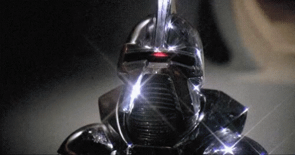

# Cylon Effect - Multiple Stars

This program is a little harder than [Single Star](./single_star.md). Instead of a single asterisk animating, see if you can make a number of asterisks (in a row) animate - like a Cylon!

as in:

Use 8 stars.

### Source code

DO NOT LOOK AT [THIS](./multiple_stars.cpp) UNTIL YOU HAVE TRIED TO WRITE THE CODE YOURSELF! With that said, don't feel bad about taking a peek and reading the comments.

## Related projects

* [Single Star](./single_star.md)
* [Walkies](./walkies.md)