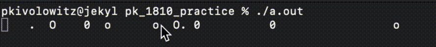

# Fizzle

Taking a different approach, `fizzle` produces this:



`fizzle` starts with all blanks in a long string. Whenever a position is blank, there is a 1 in 20 chance it will start animating.

The animation cycle is:

* `' '`
* `'.'`
* `'o'`
* `'0'`
* `'O'`
* `' '` (i.e. repeat)

One way of handling the advancement in the cycle of characters is with a `switch` statement. The transition from `' '` to `'.'` (based on a one-in-twenty) chance can be handled nicely right in the `' '` case.

These are the include files I used:

```c++
#include <cinttypes>
#include <chrono>
#include <thread>
#include <string>
#include <vector>
#include <ctime>
```

`<ctime>` is used to get access to the `time()` function which can be used to seed the old-style random number generator.

## Source code

DO NOT LOOK AT [THIS](./fizzle.cpp) UNTIL YOU HAVE TRIED TO WRITE THE CODE YOURSELF! With that said, don't feel bad about taking a peek and reading the comments.

